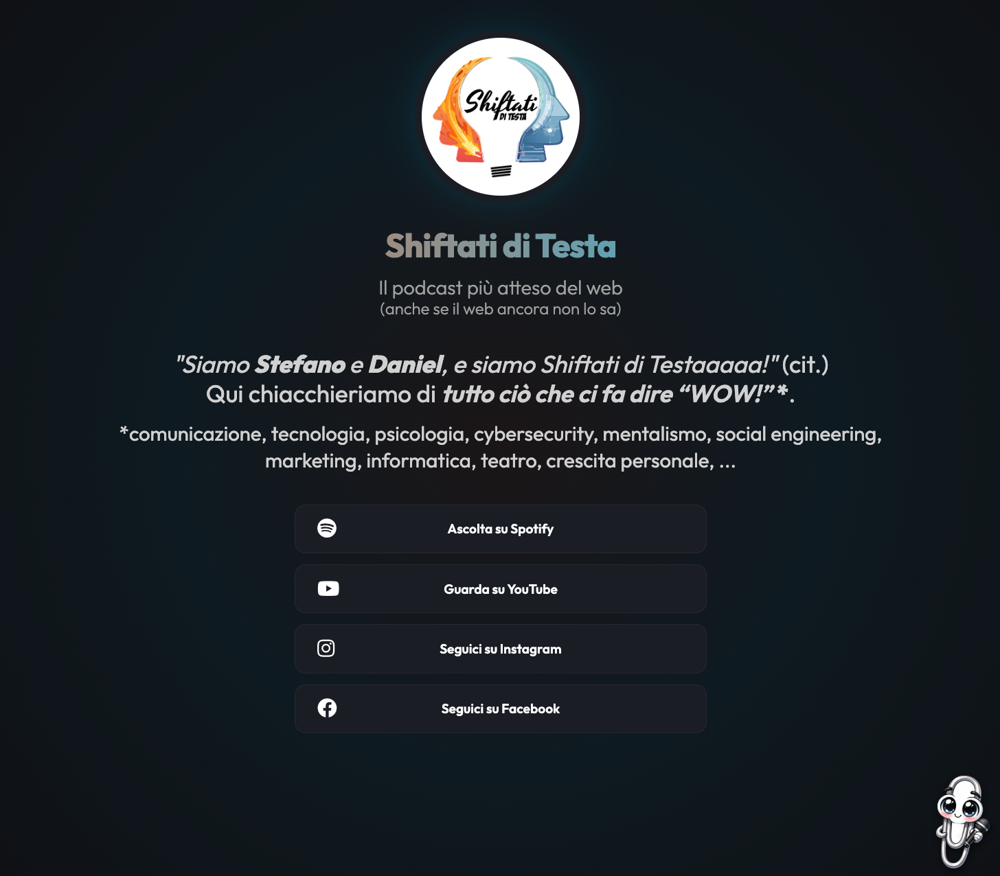

# Shiftati di Testa - Il Podcast 🎙️

Benvenuto nel repository del sito web ufficiale di **Shiftati di Testa**!

## 🎧 Cos'è Shiftati di Testa?

**Shiftati di Testa** è il podcast di Daniel e Stefano dove si chiacchiera di tutto ciò che ci fa dire **"WOW!"**.
Dalla comunicazione alla tecnologia, passando per la psicologia, il mentalismo, il social engineering e molto altro.

> *"Il podcast più atteso del web (anche se il web ancora non lo sa)"*

## 🌐 Il Sito

Questo sito è una landing page che raccoglie i link ai vari social del podcast, pensata per riflettere lo stile "shiftato".
Caratteristiche principali:

- **Design Dark & Neon**: Un look moderno con accenti arancioni e blu elettrico.
- **Micro-interazioni**: Hover effects e animazioni fluide.
- **Klippy**: Un assistente virtuale (molto simile a un famoso predecessore...) che dispensa massime di vita e frasi geek.
- **Link Social**: Accesso rapido a Spotify, YouTube, Instagram e Facebook.

## 🛠️ Tecnologie

- **HTML5**: Struttura semantica.
- **CSS3**: Variabili CSS, Flexbox, Grid, e animazioni keyframe.
- **JavaScript (Vanilla)**: Per la gestione di Klippy e delle interazioni.
- **Google Fonts**: Font 'Outfit' per un look pulito e moderno.
- **FontAwesome**: Per le icone dei social.

## 🚀 Come visualizzare il sito

Basta aprire il file `index.html` nel tuo browser preferito!
